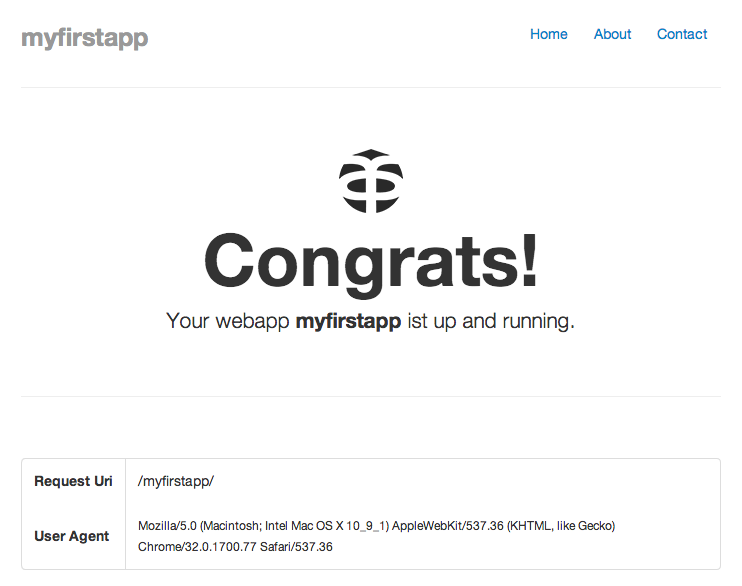

.. toctree::
    :hidden:

    documentation
    deployment

Introduction
============

The objective of the project is to develop a multi-threaded application server for PHP, written in PHP. Yes, pure PHP!
You think we aren't serious? Maybe! But we think, in order to enable as many developers in our great community, this
will be the one and only way to enable you helping us. Through the broadest possible support of the PHP community we
hopefully establish this solution as the standard for enterprise applications in PHP environment.

Highlights
----------
* Servlet engine, with full HTTP 1.1 support
* Web Socket engine, based on `Ratchet <http://socketo.me/>`_
* Session beans (stateful, stateless + singleton)
* Message beans
* Doctrine as standard Persistence provider
* Timer service
* Integrate message queue
* Web services
* Cluster functionality

Technical Features
------------------
* Joe Watkins (https://github.com/krakjoe/pthreads) phtreads Library is used
* DI & AO  usage within the respective container
* Use of annotations to configure beans
* Configuration by Exception (optional Usage of Deployment Descriptor possible)

The implementation of a Web application and its operation in the PHP Application Server must be as simple as possible.
For this purpose, whenever possible, the utilization of standard solution based on existing components as a, such as
Doctrine, are used. On the other hand, with the paradigm Configuration by exception, the operation of an application
with a minimum of configuration is needed. So a lot of the use cases is already covered by the default behavior of the
respective integrated components so that the developer often does not need declarative configuration information. To
appeal to the widest possible community the architecture of the Application Server must be constructed so that as large
a number of existing applications can easily be migrated via adapter. Furthermore, the future development of Web
applications based on all relevant PHP frameworks by providing libraries is supported.

Installation
============

Requirements
------------
* PHP 5.4+ on x64 or x86
* ZTS Enabled (Thread Safety)
* Posix Threads Implementation

The lastest version is only tested with Mac OS 10.8+ and Debian Wheezy. PHP Application Server should run on any PHP
version from 5.3+. However segmentation faults occurred in various tests with PHP 5.3.x repeatedly. Meanwhile this can
lead to the early development stage of the pthreads library. We actually use PHP 5.5.+ for development.

Installation
------------
Actually we support Mac OS X Mountain Lion and Debian Wheezy. We also plan to release a Windows installer and a RPM
package as soon as possible but as we're only Mac users we'll be happy if someone is out there to support us with that
stuff. Finally it's possible to build the runtime by yourself. This can be done by cloning our [Runtime Environment]
(https://github.com/techdivision/TechDivision_Runtime). We've added two ANT targets ``create-pkg`` and ``create-deb``
that should do the stuff for you.

Installation on Mountain Lion
~~~~~~~~~~~~~~~~~~~~~~~~~~~~~
To install on your Mac OS X Mountain Lion please download the actual .pkg Package from http://www.appserver.io.
After downlaod the .pkg you can start installation process with a double click on the package. To install the
software you need to have administration privileges (sudo). After the installation process, that is really simple,
you'll find the Application Server software in the folder ``/opt/appserver``.

When the installation has been finished the Application Server will be started automatically. If you need to restart
the Application Server, after you've deployed a new app for example, you can use the init scripts ``sbin/appserverctl``
and ``sbin/memcachectl`` therefore. Both accept ``start``, ``stop`` and ``restart`` as parameter.

Start your favorite browser and open the URL ``http://127.0.0.1:8586/demo`` to load the demo application.

Installation on a Debian Wheezy
~~~~~~~~~~~~~~~~~~~~~~~~~~~~~~~
If you're on a Debian system you don't need to download the .deb package. Follow these instructions::

    root@debian:~# echo “deb http://deb.appserver.io/ wheezy main” >> /etc/apt/sources.list
    root@debian:~# wget http://deb.appserver.io/appserver.gpg
    root@debian:~# cat appserver.gpg | apt-key add -
    root@debian:~# aptitude update
    root@debian:~# aptitude install appserver

This will install the Application Server in directory ``/opt/appserver``. Also it'll be started automatically, but you
can start, stop or restart it with the init-script ``/etc/init.d/appserver`` and the parameter ``start``, ``stop`` and
``restart``. Additionally it is necessary that the memcached daemon has been started before the Application Server will
be started itself.

After installation you can open a really simply example app with your favorite browser open the URL
``http://127.0.0.1:8586/demo``.

Getting Started Tutorial
========================

This is a getting started tutorial for all folks who want to get in touch with appserver and want to learn how it works.
It will guide you through setting up your first webapp, which serves HTTP requests. All necessary steps are explained in
detail. It is assumed that you already installed appserver via the installer packages (explained above).

Let's get started
-----------------
The appserver has its own runtime environment. After you installed appserver successfully on your system, it is accessible
under ``/opt/appserver``. This runtime already contains all necessary files and binaries to run appserver. There is a
folder ``webapps`` where all your web applications are deployed. So let's get you up running your first webapp. Type
the following into your terminal::

    cd /opt/appserver/webapps
    composer.phar create-project techdivision/techdivision_applicationserverproject myfirstapp dev-master

*myfirstapp* is the name of the webapp, it is necessary to call it by url. If you haven't already started the appserver
do it now by typing (user *restart* if appserver is already running)::

    [Mac OS] sudo /opt/appserver/sbin/appserverctl start
    [Debian] sudo /etc/init.d/appserver start

By default the appserver is running on port 8586. Therefore head over to ``localhost:8586/myfirstapp``. Notice the webapp
name in the url, if you have chosen something else as the name, use it instead of *myfirstapp*.

Let's look into some source code to get to know how everything works. Open up your webapps folder ``webapps/myfirstapp``
in your favourite editor. The structure of the web application is similar to webapp structures of Tomcat or JBoss. Open
``WEB-INF/web.xml``. This is the configuration file for your webapp's routes. In general it is the servlet configuration
for your servlet container. A servlet can be defined as follows:

.. code-block:: xml
    :linenos:

    <servlet>
        <description><![CDATA[A demo servlet]]></description>
        <display-name>DemoServlet</display-name>
        <servlet-name>DemoServlet</servlet-name>
        <servlet-class>\TechDivision\Example\Servlets\DemoServlet</servlet-class>
    </servlet>

There you define the servlet name and map it to a servlet class defined by a namespace. If you open ``WEB-INF/classes``
you will find the defined servlet. This servlet can now be used in a route mapping like the following.

.. code-block:: xml
    :linenos:

    <servlet-mapping>
        <servlet-name>DemoServlet</servlet-name>
        <url-pattern>/</url-pattern>
    </servlet-mapping>

Try some other url patterns here, restart the appserver and test them in the browser's url bar. It will always call the
same servlet which delivers the same content. Let's inspect the corresponding servlet class by opening
``WEB-INF/webapps/classes/TechDivisioon/Example/Servlets/DemoServlet.php``. The servlet deviates from ``HttpServlet`` as
it conforms to the HTTP 1.1 protocol. For every method of this protocol a function is provided by this class which can
be overridden. Most of the time you will use ``doGet()`` or ``doPost()`` for GET and POST methods. Let's inspect the
``doGet()`` in detail.

.. code-block:: php
    :linenos:

    public function doGet(Request $req, Response $res)
    {
        // build path to template
        $pathToTemplate = $this->getServletConfig()->getWebappPath() .
            DIRECTORY_SEPARATOR . 'static' .
            DIRECTORY_SEPARATOR . 'templates' .
            DIRECTORY_SEPARATOR . 'layout.phtml';

        // init template
        $template = new DemoTemplate($pathToTemplate);

        $baseUrl = '/';
        // if the application has NOT been called over a
        //VHost configuration append application folder naem
        if (!$this->getServletConfig()->getApplication()->isVhostOf(
            $req->getServerName())
        ) {
            $baseUrl .= $this->getServletConfig()->getApplication()->getName() . '/';
        }

        // set vars in template
        $template->setBaseUrl($baseUrl);
        $template->setRequestUri($req->getUri());
        $template->setUserAgent($req->getHeader("User-Agent"));
        $template->setWebappName($this->getServletConfig()->getApplication()->getName());

        // set response content by render template
        $res->setContent($template->render());
    }

First the path to the template is built, afterwards the template is constructed. The template needs some data to display,
which is set by several functions. The last line of the function sets the response content, which is send back to the
client. You can inspect the template on your own. It is easy enough to understand by reading the code. You can of course
use your own template functionalities or engines if you want. This template class is just a simple approach for
demonstration purposes.

If you want to add static content like images to your template you have to define a static servlet. Fortunately there
already exists one. Open ``WEB-INF/web.xml`` again and search for ``StaticResourceServlet``. You see the corresponding
url pattern is defined as ``/components/*`` or ``/static/*``, which means that all static content should be loaded by `
these url patterns. You can define whatever url pattern you want for your static resources. We simply separated between
libraries and custom stuff.

Let's build something CRUDish
-----------------------------
You already learned how to configure and create a servlet, which is conform to the HTTP protocol and can deliver content
to the client. Now it is time to dive deep into the structure of the appserver. As a first webapp we will build something
CRUDish, which involves data handling. In order to store some data you can set up your own database somewhere you can
connect to. In your servlet you can connect to it and everything is fine. But wait! This is just the old school PHP
stuff, how to handle data with Apache or similar servers. As we use the appserver we have much more advantages. The
appserver comes along with a persistence container. With this architecture, your webapp is scalable, as containers can
scale. You will learn by this tutorial how this works in detail.

Let's build a little system which can save customers. After creating a new customer, we can view them again. The first
step is to build a little form which takes the users input data and send it to the server. Therefore, we head over to
``WEB-INF/web.xml`` and add our route for this form.

.. code-block:: xml
    :linenos:

    <servlet>
        <description><![CDATA[A customer servlet]]></description>
        <display-name>CustomerServlet</display-name>
        <servlet-name>CustomerServlet</servlet-name>
        <servlet-class>\TechDivision\Example\Servlets\CustomerServlet</servlet-class>
    </servlet>

    <servlet-mapping>
        <servlet-name>CustomerServlet</servlet-name>
        <url-pattern>/customer</url-pattern>
    </servlet-mapping>

The customer servlet is now callable via the route ``/customer``. But before we do so, let's create the servlet. It is a
class in the path ``WEB-INF/classes/TechDivision/Example/Servlets`` (this depends on the namespace you defined in
``web.xml``).

.. code-block:: php
    :linenos:

    namespace TechDivision\Example\Servlets;

    use TechDivision\ServletContainer\Interfaces\Request;
    use TechDivision\ServletContainer\Interfaces\Response;
    use TechDivision\ServletContainer\Servlets\HttpServlet;

    class CustomerServlet extends HttpServlet
    {
        public function doGet(Request $req, Response $res)
        {
            $res->setContent('Hello World');
        }
    }

It is now time to restart your appserver in order to reload the changes made. After that open the url of your webapp
and you will see this:

.. image:: images/helloworld.png

As we can see the content we set to the response is transmitted to the client. A first template can now be build and
delivered on the same way.

.. code-block:: php
    :linenos:

    public function doGet(Request $req, Response $res)
    {
        $webappPath = $this->getServletConfig()->getWebappPath();

        // check if the template is available
        if (!file_exists(
                $pathToTemplate = $webappPath .
                DIRECTORY_SEPARATOR . 'static/templates/customer.phtml'
        )) {
            throw new \Exception(
                "Requested template '$pathToTemplate' is not available"
            );
        }

        // render template
        ob_start();
        require $pathToTemplate;
        $html = ob_get_clean();

        $res->setContent($html);
    }

The templates are in the directory ``static/templates`` of the webapp root directory. If it exists it gets rendered and
its output is set as the response's content. The only thing to do is to fill the template with life. Create the file
``static/templates/customer.phtml`` and insert the following.

.. code-block:: html
    :linenos:

    <!DOCTYPE html>
    <html lang="en">
    <head>
        <meta charset="utf-8">
    </head>
    <body>
        <form action="customer" method="post">
            <input type="hidden" name="action" value="persist" />
            <input type="hidden" name="customerId" value="<?php echo $customerId ?>" />
            <input name="name" type="text" placeholder="Enter customer name" />
            <button type="submit" class="btn">Submit</button>
        </form>
    </body>
    </html>

As you can see the form uses the POST method to post its data. As we only support GET in ``CustomerServlet`` we have to
implement a corresponding method which can handle POST.

.. code-block:: php
    :linenos:

    public function doPost(Request $req, Response $res)
    {
        // load the params with the entity data
        $parameterMap = $req->getParameterMap();

        // check if the necessary params has been specified and are valid
        if (!array_key_exists('customerId', $parameterMap)) {
            throw new \Exception();
        } else {
            $customerId = filter_var($parameterMap['customerId'], FILTER_VALIDATE_INT);
        }
        if (!array_key_exists('name', $parameterMap)) {
            throw new \Exception();
        } else {
            $name = filter_var($parameterMap['name'], FILTER_SANITIZE_STRING);
        }

        $res->setContent('Hello ' . $name);
    }

So far so good, but we want to persist the customer to the database. Therefore we have to take a look on the persistence
container. Open ``META-INF/appserver-ds.xml``. This is a dummy configuration file for the persistence container. Change
it to the following.

.. code-block:: xml
    :linenos:

    <datasources>
        <datasource name="TechDivision\Example"
            type="TechDivision\PersistenceContainer\Application">
            <database>
                <driver>pdo_sqlite</driver>
                <user>appserver</user>
                <password>appserver</password>
                <path>META-INF/data/customers.sqlite</path>
                <memory>false</memory>
            </database>
        </datasource>
    </datasources>

This configuration defines a data source connection to a database. In this case we use a sqlite database for demonstration
purposes. We defined the path to the database as well as the path to the entities which get persisted to it. It is now
time to create our customer entity. Create the following class
``META-INF/classes/TechDivision/Example/Entities/Customer.php``.

.. code-block:: php
    :linenos:

    namespace TechDivision\Example\Entities;

    /**
     * @Entity @Table(name="customer")
     */
    class Customer {
        /**
         * @Id
         * @Column(type="integer")
         * @GeneratedValue
         */
        public $customerId;

        /**
         * @Column(type="string", length=255)
         */
        public $name;

        public function setCustomerId($customerId) {
            $this->customerId = $customerId;
        }

        public function getCustomerId() {
            return $this->customerId;
        }

        public function setName($name) {
            $this->name = $name;
        }

        public function getName() {
            return $this->name;
        }
    }

Maybe you can guess from the annotations which persistence layer we use here. It is Doctrine which is already part of the
appserver. This is an entity which Doctrine can parse and persist. The entity gets persisted by an entity processor which
takes care of the entities' states. At this point there is the tricky but cool part of appserver. As we want to persist
the customer we have to talk to the persistence container which is all part of the ``META-INF`` folder. This is done by
sockets in order to deploy both containers (servlet and persistence) on different machines, if necessary. Therefore, you
can scale appserver as much as you want. Right now only the persistence container has the customer class and the servlet
container does not know anything about it. We have to copy the customer class into the servlet container right into
``WEB-INF/classes/TechDivision/Example/Entities/Customer.php``. As such we can now use it in our servlet. Insert the
following lines right before the method ``doPost()`` ends:

.. code-block:: php
    :linenos:

    use TechDivision\Example\Entities\Customer;

    ...

    // create a new entity and persist it
    $entity = new Customer();
    $entity->setCustomerId((integer) $customerId);
    $entity->setName($name);

    $initialContext = $this->session->createInitialContext();
    $proxy = $initialContext->lookup(
        'TechDivision\Example\Services\CustomerProcessor'
    );
    $proxy->persist($entity);

    $res->setContent('Hello ' . $name);

As you can already see we have a session attribute. This session is a context session which can handle our current
context. The initial context provides us with a proxy class for a class of the persistence container. In this example
we want to connect to the ``CustomerProcessor`` class as it handles our CRUD actions for our entity. We can communicate
to the processor via a socket which is represented by the proxy class whereas the proxy class is just a general proxy
implementation and not dependent on the ``CustomerProcessor`` class. The method call of ``persist()`` is actually done
by remote method invocation via sockets. In order to make the code lines work we have to add the following lines to
our customer servlet.

.. code-block:: php
    :linenos:

    use TechDivision\PersistenceContainerClient\Context\Connection\Factory;

    ...

    protected $connection;
    protected $session;

    public function __construct() {
        $this->connection = Factory::createContextConnection();
        $this->session = $this->connection->createContextSession();
    }

We are now ready to start the implementation of ``CustomerProcessor``. As we don't want to overwhelm the documentation
with lines of code we will copy some prepared one. We head over to the ``example`` webapp of the appserver. You can
find the example webapp in appserver's root directory in the folder ``webapps``. Copy the class
``META-INF/classes/TechDivision/Example/Services/AbstractProcessor.php`` to our project at the same path. In the same
folder we create the ``CustomerProcessor.php`` class as follows.

.. code-block:: php
    :linenos:

    namespace TechDivision\Example\Services;

    use TechDivision\Example\Entities\Customer;
    use TechDivision\Example\Services\AbstractProcessor;
    use Doctrine\ORM\Tools\SchemaTool;

    /**
     * @Singleton
     */
    class CustomerProcessor extends AbstractProcessor
    {
        public function createSchema()
        {
            // load the entity manager and the schema tool
            $entityManager = $this->getEntityManager();
            $tool = new SchemaTool($entityManager);

            // initialize the schema data from the entities
            $classes = array(
                $entityManager->getClassMetadata('TechDivision\Example\Entities\Customer')
            );

            // drop the schema if it already exists and create it new
            $tool->dropSchema($classes);
            $tool->createSchema($classes);
        }

        public function persist(Customer $entity)
        {
            // load the entity manager
            $entityManager = $this->getEntityManager();
            // check if a detached entity has been passed
            if ($entity->getCustomerId()) {
                $merged = $entityManager->merge($entity);
                $entityManager->persist($merged);
            } else {
                $entityManager->persist($entity);
            }
            // flush the entity manager
            $entityManager->flush();
            // and return the entity itself
            return $entity;
        }
    }

We overwrite the ``createSchema()`` method of the abstract processor as we have a different entity. But the rest of the
abstract class works for us as well. You may have noticed the ``@Singleton`` above the class name. This exhibits that
the customer processor is a singleton bean. It means that only one instance of it is created which is necessary as there
are no conflicts while persisting. There are also stateless and stateful beans which are for other purposes, as they
either know the state between two requests of the same user or not. The ``persist()`` method gets the doctrine entity
manager in order to persist entities. After successful persistence we want to display all entities in the frontend. We
therefore implement the following method into our customer processor.

.. code-block:: php
    :linenos:

    public function findAll()
    {
        $entityManager = $this->getEntityManager();
        $repository = $entityManager->getRepository(
            'TechDivision\Example\Entities\Customer'
        );
        return $repository->findAll();
    }

This works again with the doctrine entity manager as it does all the work for us. In order to display all customers
in the frontend we add the following lines of code at the start of the ``doGet()`` method in our customer servlet.

.. code-block:: php
    :linenos:

    // member variable
    protected $customers;

    ...

    // doGet() method
    $initialContext = $this->session->createInitialContext();
    $proxy = $initialContext->lookup('TechDivision\Example\Services\CustomerProcessor');
    $this->customers = $proxy->findAll();

It is the same principle. We request again a proxy class which takes all the communication for us via the socket. We just
call the ``findAll()`` method we already implemented in our customer processor. The final step is now to customize the
template like this:

.. code-block:: php
    :linenos:

    <?php foreach ($this->customers as $customer): ?>
        
<?php echo $customer->getName() ?>

    <?php endforeach; ?>

We iterate over all customers and echo their names. The final step is now to change the ``doPost()`` method as we still
return the Hello World example. Change the last line of the method to this line:

.. code-block:: php
    :linenos:

    $this->doGet($req, $res);

It is now time to restart the appserver again and go to ``localhost:8586/myfirstapp/customer`` to see what we have built.
You can now type in new customer names and view them in the frontend. Please note that this is just a very simple example
to demonstrate how appserver works. It is a beginner tutorial. The demonstrated code should clearly be refactored, but
for this tutorial it is good to go. Feel free to try out more functionality like updating and deleting entities.
